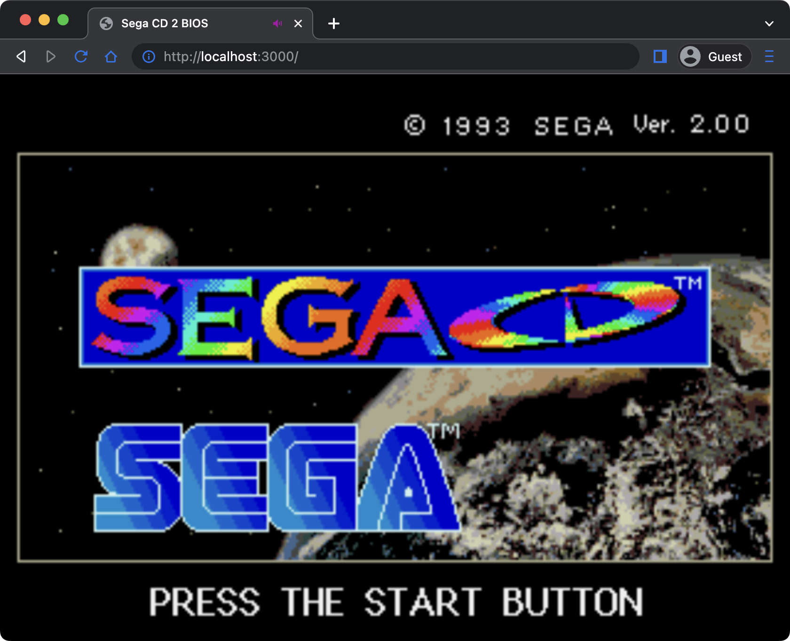

# SegaCDBIOSWeb
Sega CD BIOS running on Web, based on [Emulatrix](https://github.com/lrusso/Emulatrix).

<div align="center">
  
</div>
<br/>

This web shows v2.00 by default. To show v1.10, add `?bios=us1` to the URL.

## License
```
Emulatrix is licensed under GPLv3.
Sega CD BIOS is © 1993 SEGA CORPORATION.
```
